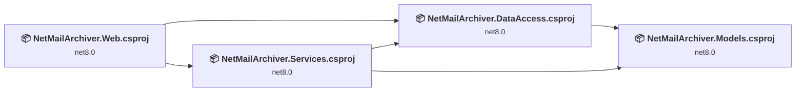
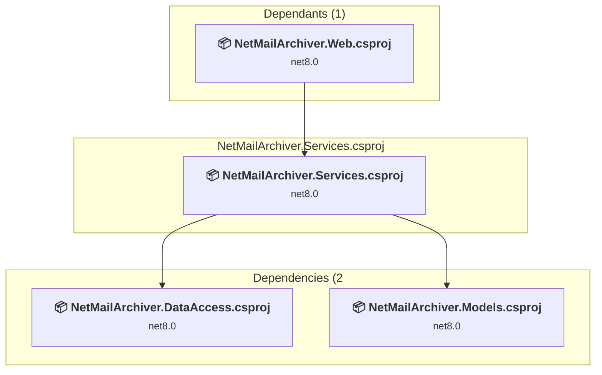
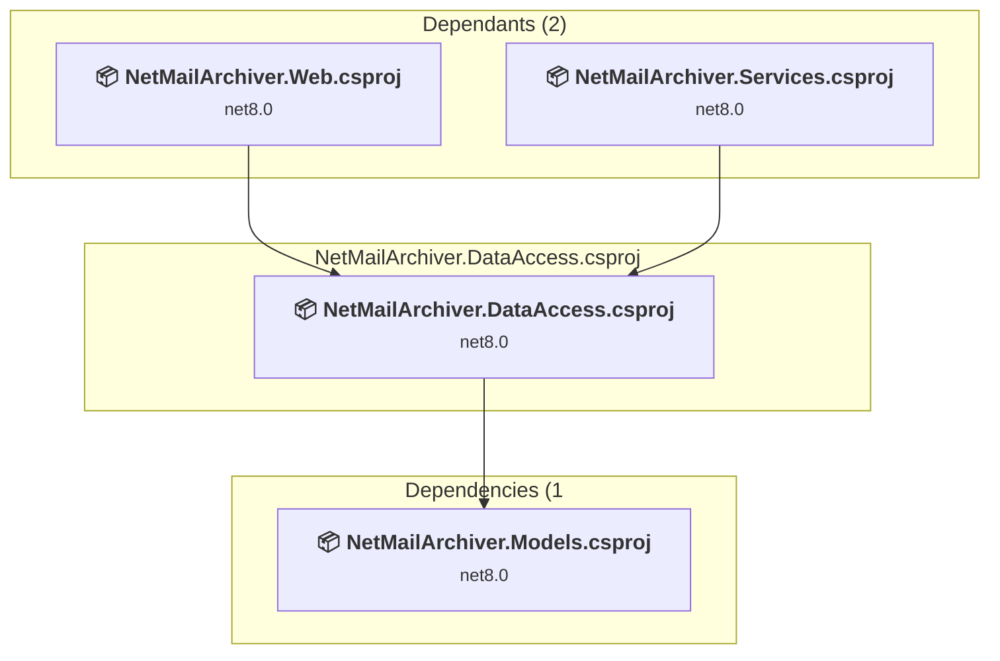
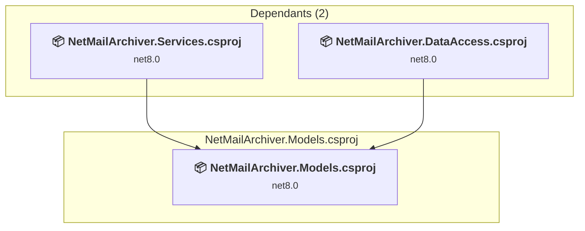
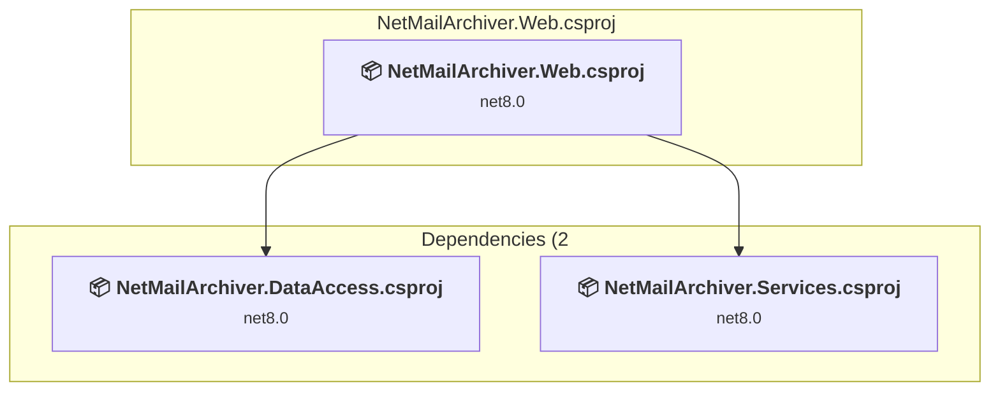

# Projects and dependencies analysis

This document provides a comprehensive overview of the projects and their dependencies in the context of upgrading to .NETCoreApp,Version=v10.0.

## Table of Contents

- [Executive Summary](#executive-Summary)
  - [Highlevel Metrics](#highlevel-metrics)
  - [Projects Compatibility](#projects-compatibility)
  - [Package Compatibility](#package-compatibility)
  - [API Compatibility](#api-compatibility)
- [Aggregate NuGet packages details](#aggregate-nuget-packages-details)
- [Top API Migration Challenges](#top-api-migration-challenges)
  - [Technologies and Features](#technologies-and-features)
  - [Most Frequent API Issues](#most-frequent-api-issues)
- [Projects Relationship Graph](#projects-relationship-graph)
- [Project Details](#project-details)

  - [NetMailArchiver.Controllers\NetMailArchiver.Services.csproj](#netmailarchivercontrollersnetmailarchiverservicescsproj)
  - [NetMailArchiver.DataAccess\NetMailArchiver.DataAccess.csproj](#netmailarchiverdataaccessnetmailarchiverdataaccesscsproj)
  - [NetMailArchiver.Models\NetMailArchiver.Models.csproj](#netmailarchivermodelsnetmailarchivermodelscsproj)
  - [NetMailArchiver.Web\NetMailArchiver.Web.csproj](#netmailarchiverwebnetmailarchiverwebcsproj)

## Executive Summary

### Highlevel Metrics

| Metric | Count | Status |
| :--- | :---: | :--- |
| Total Projects | 4 | All require upgrade |
| Total NuGet Packages | 10 | 4 need upgrade |
| Total Code Files | 34 |  |
| Total Code Files with Incidents | 5 |  |
| Total Lines of Code | 3506 |  |
| Total Number of Issues | 11 |  |
| Estimated LOC to modify | 2+ | at least 0,1% of codebase |

### Projects Compatibility

| Project | Target Framework | Difficulty | Package Issues | API Issues | Est. LOC Impact | Description |
| :--- | :---: | :---: | :---: | :---: | :---: | :--- |
| [NetMailArchiver.Controllers\NetMailArchiver.Services.csproj](#netmailarchivercontrollersnetmailarchiverservicescsproj) | net8.0 | 🟢 Low | 0 | 0 |  | ClassLibrary, Sdk Style = True |
| [NetMailArchiver.DataAccess\NetMailArchiver.DataAccess.csproj](#netmailarchiverdataaccessnetmailarchiverdataaccesscsproj) | net8.0 | 🟢 Low | 1 | 0 |  | ClassLibrary, Sdk Style = True |
| [NetMailArchiver.Models\NetMailArchiver.Models.csproj](#netmailarchivermodelsnetmailarchivermodelscsproj) | net8.0 | 🟢 Low | 0 | 0 |  | ClassLibrary, Sdk Style = True |
| [NetMailArchiver.Web\NetMailArchiver.Web.csproj](#netmailarchiverwebnetmailarchiverwebcsproj) | net8.0 | 🟢 Low | 4 | 2 | 2+ | AspNetCore, Sdk Style = True |

### Package Compatibility

| Status | Count | Percentage |
| :--- | :---: | :---: |
| ✅ Compatible | 6 | 60,0% |
| ⚠️ Incompatible | 1 | 10,0% |
| 🔄 Upgrade Recommended | 3 | 30,0% |
| ***Total NuGet Packages*** | ***10*** | ***100%*** |

### API Compatibility

| Category | Count | Impact |
| :--- | :---: | :--- |
| 🔴 Binary Incompatible | 0 | High - Require code changes |
| 🟡 Source Incompatible | 0 | Medium - Needs re-compilation and potential conflicting API error fixing |
| 🔵 Behavioral change | 2 | Low - Behavioral changes that may require testing at runtime |
| ✅ Compatible | 11182 |  |
| ***Total APIs Analyzed*** | ***11184*** |  |

## Aggregate NuGet packages details

| Package | Current Version | Suggested Version | Projects | Description |
| :--- | :---: | :---: | :--- | :--- |
| MailKit | 4.9.0 |  | [NetMailArchiver.Services.csproj](#netmailarchivercontrollersnetmailarchiverservicescsproj) | ✅Compatible |
| Microsoft.EntityFrameworkCore | 9.0.0 | 10.0.5 | [NetMailArchiver.DataAccess.csproj](#netmailarchiverdataaccessnetmailarchiverdataaccesscsproj) [NetMailArchiver.Web.csproj](#netmailarchiverwebnetmailarchiverwebcsproj) | Ein NuGet-Paketupgrade wird empfohlen |
| Microsoft.EntityFrameworkCore.Design | 9.0.0 | 10.0.5 | [NetMailArchiver.Web.csproj](#netmailarchiverwebnetmailarchiverwebcsproj) | Ein NuGet-Paketupgrade wird empfohlen |
| Microsoft.EntityFrameworkCore.Tools | 9.0.0 | 10.0.5 | [NetMailArchiver.Web.csproj](#netmailarchiverwebnetmailarchiverwebcsproj) | Ein NuGet-Paketupgrade wird empfohlen |
| Microsoft.VisualStudio.Azure.Containers.Tools.Targets | 1.21.0 |  | [NetMailArchiver.Web.csproj](#netmailarchiverwebnetmailarchiverwebcsproj) | ⚠️Das NuGet-Paket ist nicht kompatibel |
| Npgsql.EntityFrameworkCore.PostgreSQL | 9.0.2 |  | [NetMailArchiver.DataAccess.csproj](#netmailarchiverdataaccessnetmailarchiverdataaccesscsproj) [NetMailArchiver.Web.csproj](#netmailarchiverwebnetmailarchiverwebcsproj) | ✅Compatible |
| NToastNotify | 8.0.0 |  | [NetMailArchiver.Web.csproj](#netmailarchiverwebnetmailarchiverwebcsproj) | ✅Compatible |
| Quartz | 3.13.1 |  | [NetMailArchiver.Services.csproj](#netmailarchivercontrollersnetmailarchiverservicescsproj) | ✅Compatible |
| Quartz.AspNetCore | 3.13.1 |  | [NetMailArchiver.Services.csproj](#netmailarchivercontrollersnetmailarchiverservicescsproj) | ✅Compatible |
| Quartz.Extensions.DependencyInjection | 3.14.0 |  | [NetMailArchiver.Web.csproj](#netmailarchiverwebnetmailarchiverwebcsproj) | ✅Compatible |

## Top API Migration Challenges

### Technologies and Features

| Technology | Issues | Percentage | Migration Path |
| :--- | :---: | :---: | :--- |

### Most Frequent API Issues

| API | Count | Percentage | Category |
| :--- | :---: | :---: | :--- |
| M:Microsoft.AspNetCore.Builder.ExceptionHandlerExtensions.UseExceptionHandler(Microsoft.AspNetCore.Builder.IApplicationBuilder,System.String) | 1 | 50,0% | Behavioral Change |
| M:Microsoft.Extensions.DependencyInjection.HttpClientFactoryServiceCollectionExtensions.AddHttpClient(Microsoft.Extensions.DependencyInjection.IServiceCollection) | 1 | 50,0% | Behavioral Change |

## Projects Relationship Graph

Legend:
📦 SDK-style project
⚙️ Classic project

## Project Details

### NetMailArchiver.Controllers\NetMailArchiver.Services.csproj

#### Project Info

- **Current Target Framework:** net8.0
- **Proposed Target Framework:** net10.0
- **SDK-style**: True
- **Project Kind:** ClassLibrary
- **Dependencies**: 2
- **Dependants**: 1
- **Number of Files**: 6
- **Number of Files with Incidents**: 1
- **Lines of Code**: 541
- **Estimated LOC to modify**: 0+ (at least 0,0% of the project)

#### Dependency Graph

Legend:
📦 SDK-style project
⚙️ Classic project

### API Compatibility

| Category | Count | Impact |
| :--- | :---: | :--- |
| 🔴 Binary Incompatible | 0 | High - Require code changes |
| 🟡 Source Incompatible | 0 | Medium - Needs re-compilation and potential conflicting API error fixing |
| 🔵 Behavioral change | 0 | Low - Behavioral changes that may require testing at runtime |
| ✅ Compatible | 625 |  |
| ***Total APIs Analyzed*** | ***625*** |  |

### NetMailArchiver.DataAccess\NetMailArchiver.DataAccess.csproj

#### Project Info

- **Current Target Framework:** net8.0
- **Proposed Target Framework:** net10.0
- **SDK-style**: True
- **Project Kind:** ClassLibrary
- **Dependencies**: 1
- **Dependants**: 2
- **Number of Files**: 1
- **Number of Files with Incidents**: 1
- **Lines of Code**: 24
- **Estimated LOC to modify**: 0+ (at least 0,0% of the project)

#### Dependency Graph

Legend:
📦 SDK-style project
⚙️ Classic project

### API Compatibility

| Category | Count | Impact |
| :--- | :---: | :--- |
| 🔴 Binary Incompatible | 0 | High - Require code changes |
| 🟡 Source Incompatible | 0 | Medium - Needs re-compilation and potential conflicting API error fixing |
| 🔵 Behavioral change | 0 | Low - Behavioral changes that may require testing at runtime |
| ✅ Compatible | 40 |  |
| ***Total APIs Analyzed*** | ***40*** |  |

### NetMailArchiver.Models\NetMailArchiver.Models.csproj

#### Project Info

- **Current Target Framework:** net8.0
- **Proposed Target Framework:** net10.0
- **SDK-style**: True
- **Project Kind:** ClassLibrary
- **Dependencies**: 0
- **Dependants**: 2
- **Number of Files**: 3
- **Number of Files with Incidents**: 1
- **Lines of Code**: 80
- **Estimated LOC to modify**: 0+ (at least 0,0% of the project)

#### Dependency Graph

Legend:
📦 SDK-style project
⚙️ Classic project

### API Compatibility

| Category | Count | Impact |
| :--- | :---: | :--- |
| 🔴 Binary Incompatible | 0 | High - Require code changes |
| 🟡 Source Incompatible | 0 | Medium - Needs re-compilation and potential conflicting API error fixing |
| 🔵 Behavioral change | 0 | Low - Behavioral changes that may require testing at runtime |
| ✅ Compatible | 119 |  |
| ***Total APIs Analyzed*** | ***119*** |  |

### NetMailArchiver.Web\NetMailArchiver.Web.csproj

#### Project Info

- **Current Target Framework:** net8.0
- **Proposed Target Framework:** net10.0
- **SDK-style**: True
- **Project Kind:** AspNetCore
- **Dependencies**: 2
- **Dependants**: 0
- **Number of Files**: 35
- **Number of Files with Incidents**: 2
- **Lines of Code**: 2861
- **Estimated LOC to modify**: 2+ (at least 0,1% of the project)

#### Dependency Graph

Legend:
📦 SDK-style project
⚙️ Classic project

### API Compatibility

| Category | Count | Impact |
| :--- | :---: | :--- |
| 🔴 Binary Incompatible | 0 | High - Require code changes |
| 🟡 Source Incompatible | 0 | Medium - Needs re-compilation and potential conflicting API error fixing |
| 🔵 Behavioral change | 2 | Low - Behavioral changes that may require testing at runtime |
| ✅ Compatible | 10398 |  |
| ***Total APIs Analyzed*** | ***10400*** |  |

